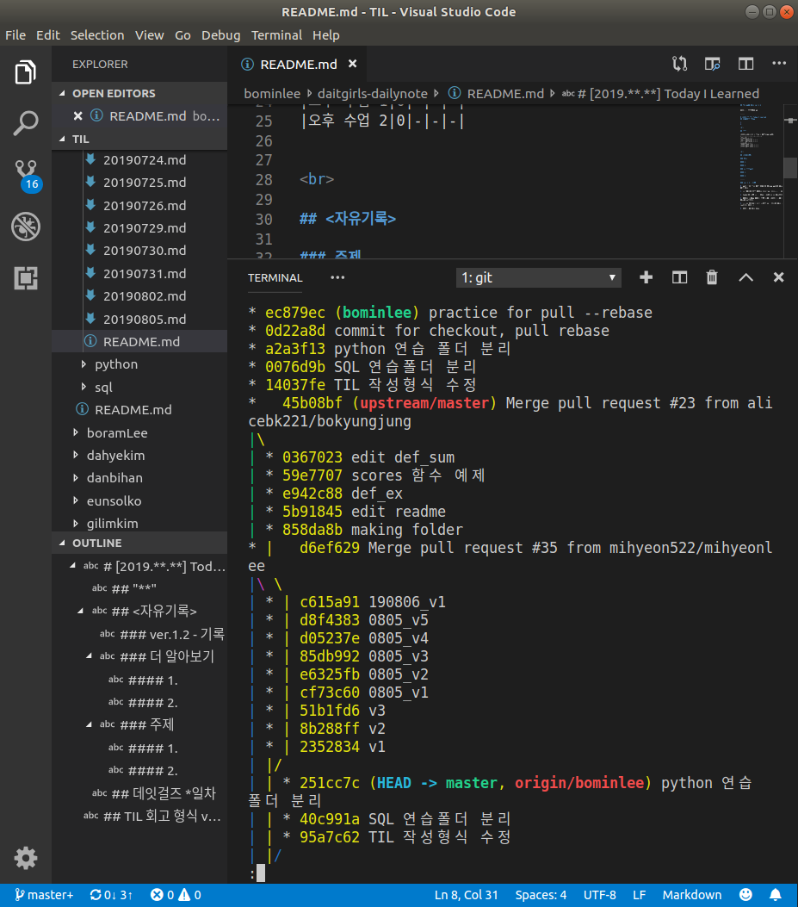

# [2019.08.07] Today I Learned
## 데잇걸즈 11일차

1. SQL JOIN 복습, 숙제 검사
2. pandas 구경
3. Python 추상화, function 복습
4. github advanced
<br>
## "pandas 완전 좋아. 개신기해"

|시간|점수|상황 | 감정 | 앞으로의 다짐|
|:---:|:---:|---|---|---|
|아침|8|비가 옴. 지하철 나와서 우산 안가지고 온 은지님이랑 같이 우산쓰고 왔다.|비와서 어제보다 훨씬 시원하다. 5분 늦었다. 사람들이 너무 피곤해보여서 걱정된다.|지각하지 말자!|
|오전 수업1|5|SQL 복습. SQL 과제 확인.|과... 과제가 있는 줄 몰랐다.. 슬랙에 올라오는 게 너무 많아서 확인을 못했다.|다음부터는 숙제 잘 해오자 ㅠㅠ|
|오전 수업2|9|Pandas 구경. SQL과 판다스 비교. 문법 속성강의.|신기하다. 완전 심플하고 완전 신기하다. SQL보다 쉬운 것 같은데.|판다스 수업자료 잘 가지고 놀아보기. 손에 익게 많이 해보기.|
|점심|8|오늘은 약을 잘 챙겨나왔다!!!|사람들이 너무 피곤해보여서 아침에 걱정했는데 점심 같이 먹으면서 얘기하니까 좀 나아졌다. 다들 쪼끔 지쳤었나보다.|기분이 나쁠 때는 맛있는 밥을 먹자.|
|오후 수업 1|10|git rebase를 배웠다!|우왕 신기해 이것도 진짜 신기하다.|rebase 연습해보기|
|오후 수업 2|8|'git pull --rebase upstream master'|이건 처음 배워보는 건데 어떻게 동작하는지 대충은 알겠는데 정확하게는 잘 모르겠다.|집에가서 프로젝트를 파고 실험을 해보자.|


<br>

## <자유기록>

### 1. Colab Notebook 사용하기

구글에서 제공하는 Colab Notebook을 사용하면 로컬에 복잡한 라이브러리 셋팅을 하지 않고도 웹 환경을 사용하여 여러가지 실습을 해볼 수 있다.

원본 Note를 복사하여 자신의 드라이브에 추가하면 사본은 내 맘대로 수정이 가능하다.

### 2. Pandas 기초

판다스는 python으로 만들어진 데이터분석용 라이브러리이지만 형태나 사용법은 R에 더 가깝다. SQL에서 사용되는 여러가지 개념들을 함수로 쓸 수 있다.

---


### 3. Github advanced

#### 1. git rebase 란


```bash
git rebase <base>

```
결과

* git rebase image


#### 2. 예쁘게 체계적으로 git으로 프로젝트 관리하는 깔끔한 방법

1. 내가 fork 해온 repo에서 branch를 파서 뭔가를 하고 pullrequest를 보내고 merge 되었다.
2. 만약 로컬에서 그 이상의 변동사항이 없었다면 이제 그거 받아오고 다시 브랜치를 따서 다른 작업을 시작하면 된다.

ex) python이라는 브런치로 python의 모든 내용을 계속 가져가지 말고 pythonWeek1 이런식으로 머지를 한 단계 할 분량의 브랜치만 만들어서 그 스텝이 합쳐졌으면 그 합쳐진 내용을 다시 불러들이고 브랜치를 없앤 후에 다시 작업을 하면 된다.

즉 pythonWeek1은 다 끝나고 merge가 되었으니 소임을 다 한거다. pullrequest하고 merge하는 도중에 pythonWeek1에 변동사항이 없고 완벽한 상태로 끝났다면 브랜치가 소임을 다한 것이므로 삭제하고 다시 합쳐진 부분에서 pythonWeek2 브랜치를 따서 2주차 정리를 시작하면 된다.

#### 2-1. 예제로 보기

##### 1. 첫번째 주에 공부했던 것들을 정리할 각각의 브랜치를 만듭니다.

```bash
git branch noteWeek1
git branch pythonWeek1
git branch sqlWeek1
```

* master
* noteWeek1
* pythonWeek1
* sqlWeek1

##### 2. 각각의 branch에 들어가 공부했던 내용을 branch에 맞게 수정한 후 add, commit push를 해줍니다


1. noteWeek1 branch로 checkout한 후 dailynote라는 폴더를 만들고 파일을 추가했다.
2. noteWeek1에서 add, commit, push 
3. pythonWeek1 branch로 checkout한 후 python이라는 폴더를 만들고 파일을 추가했다.
4. pythonWeek1에서 add, commit, push
5. sqlWeek1 branch로 checkout한 후 sql이라는 폴더를 만들고 파일을 추가했다.
6. sqlWeek1에서 add, commit, push

##### 3. 깃허브에 들어가서 모든 브랜치에서 master로 pullrequest를 날리고 merge한다.


##### 4. 깃허브 origin에서 변경 사항을 fetch해와서 merge 한다

> (master) 브랜치로 checkout 후

```bash
git fetch origin master
```


```bash
git merge origin/master
```


이제 로컬에 있는 master branch에서 모든 브랜치들이 merge된 결과를 확인 할 수 있다.

##### 5. 임무를 마친 1주차 작업용 브랜치는 이제 곱게 보내드리고 이제 새로운 2주차 브랜치를 만든다.

```bash
git branch -d noteWeek1
git branch -d pythonWeek1
git branch -d sqlWeek1
```

```bash
git branch noteWeek2
git branch pythonWeek2
git branch sqlWeek2
```


##### 6. 1~5를 계속 반복.


#### 3. 이렇게 깔끔하면 얼마나 좋겠냐만은. 그러지 못할 때.
##### 'git pull --rebase'를 쓰는법

1. 내가 fork 해온 repo에서 branch를 파서 뭔가를 하고 pullrequest를 보내고 merge 되었다.
2. 만약 로컬에서 그 이상의 변동사항이 없었다면 이제 그거 받아오고 다시 브랜치를 따서 다른 작업을 시작하면 된다.
--------
여기까지는 똑같다

3. 그런데 만약 merge될 동안 로컬에서 작업중이던 것이 있다면?
4. 그 작업을 최신 upstream 상태와 합쳐놓고 마저 작업을 하고 싶다면?
5. 'pull --rebase'를 한다.
```bash
git pull --rebase upstream
```
\* 이 명령어는 지금 내 git이 checkout 되어있는 브랜치에 upstream의 최신 상태를 fetch한 후 rebase를 해준다. 

\* 이 경우에 master에는 아무런 변화가 없는 것이 맞다. 아샬 쌤은 마스터는 신경 안쓰고 브랜치만 계속 업데이트 해서 쓰라고 하심. 



terminal의 내용만 보면 된다.

초록색 bominlee 브랜치가 초록색으로 되어있는 master가 있는 자리에서부터 갈라져 나왔었는데 `git pull --rebase`를 하고 나자 upstream/master에서 갈라져나온 것처럼 바뀌었다. bominlee 브랜치의 뿌리가 위치하는 자리를 fetch로 가져온 마지막 위치로 옮겨준 것.


<br>

### 더 알아보기

#### 1. Pandas는 진짜 판다인가?